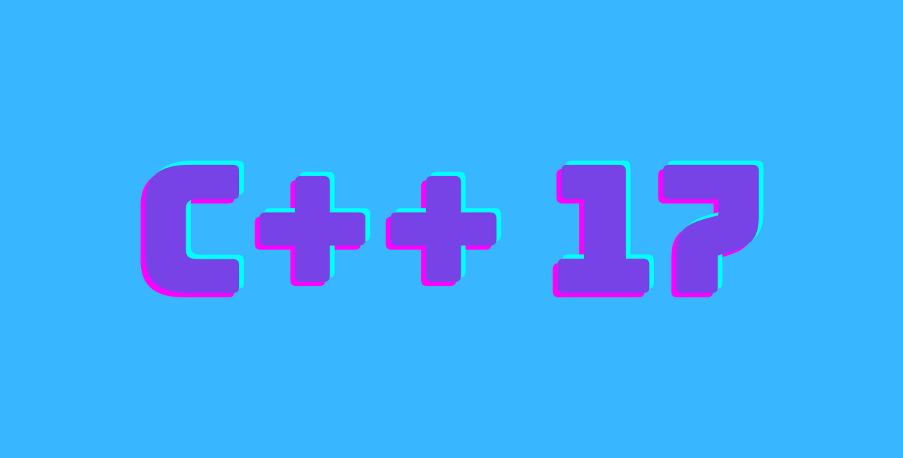

# Mastering 4 critical SKILLS using C++17

This repo contains all solutions for all assignments of [Mastering 4 critical SKILLS using C++ 17 course](https://www.udemy.com/course/cpp-4skills/)

## Usage

To use any of the code you will need to have:

- `C++` installed on your computer
- A compiler I personnaly keep it simple and use `g++`

you could use the following command to compile any file in this repo `g++ filename.cpp -o outputNameWithNoExtension`

`g++` by default compiles using `C++17` standards

## Development

The development environment as follows:

- [EndeavourOS](https://endeavouros.com/) a distribution based on Arch linux
- [vs code](https://code.visualstudio.com/) as my IDE -all the free one are bad in my own opinion-
- `g++` as the compiler
- `gdb` as the debugger
