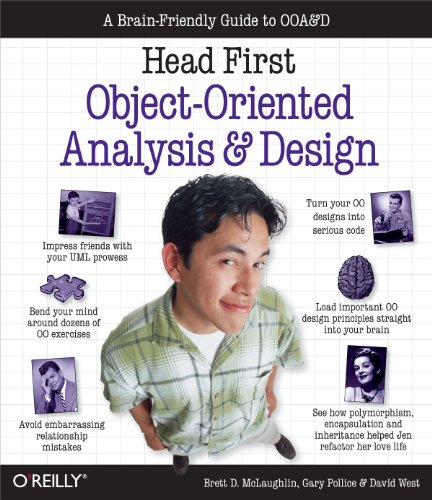
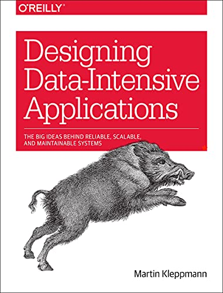

# Mastering 4 critical SKILLS using C++17

This repo contains all solutions for all assignments of [Mastering 4 critical SKILLS using C++ 17 course](https://www.udemy.com/course/cpp-4skills/)

## Usage

To use any of the code you will need to have:

- `C++` installed on your computer
- A compiler I personnaly keep it simple and use `g++`

you could use the following command to compile any file in this repo `g++ filename.cpp -o outputNameWithNoExtension`

`g++` by default compiles using `C++17` standards

## Development

The development environment as follows:

- [EndeavourOS](https://endeavouros.com/) a distribution based on Arch linux
- [vs code](https://code.visualstudio.com/) as my IDE -all the free one are bad in my own opinion-
- `g++` as the compiler
- `gdb` as the debugger

## Course Recommended CPP GuideLines

- [CPP Core Guidelines](https://github.com/isocpp/CppCoreGuidelines)
- [Google Guidelines](https://google.github.io/styleguide/cppguide.html)

## Course Recommended Reading

This is a [Quora Question](https://www.quora.com/Which-is-the-best-book-to-learn-the-concepts-of-object-oriented-programming/answer/Edson-Soares-29?ch=10&share=48be4029&srid=K5A9H#_=_) with some important recommendation for books on OOP and Software Engineering in General.

| Book                                           | Cover                                |
|------------------------------------------------|--------------------------------------|
|[Head First Object-Oriented Design and Analysis](https://www.amazon.com/Head-First-Object-Oriented-Analysis-Design/dp/0596008678) |  |
| [Designing Data-Intensive Applications book](https://www.amazon.com/Designing-Data-Intensive-Applications-Reliable-Maintainable/dp/1449373321) | |
